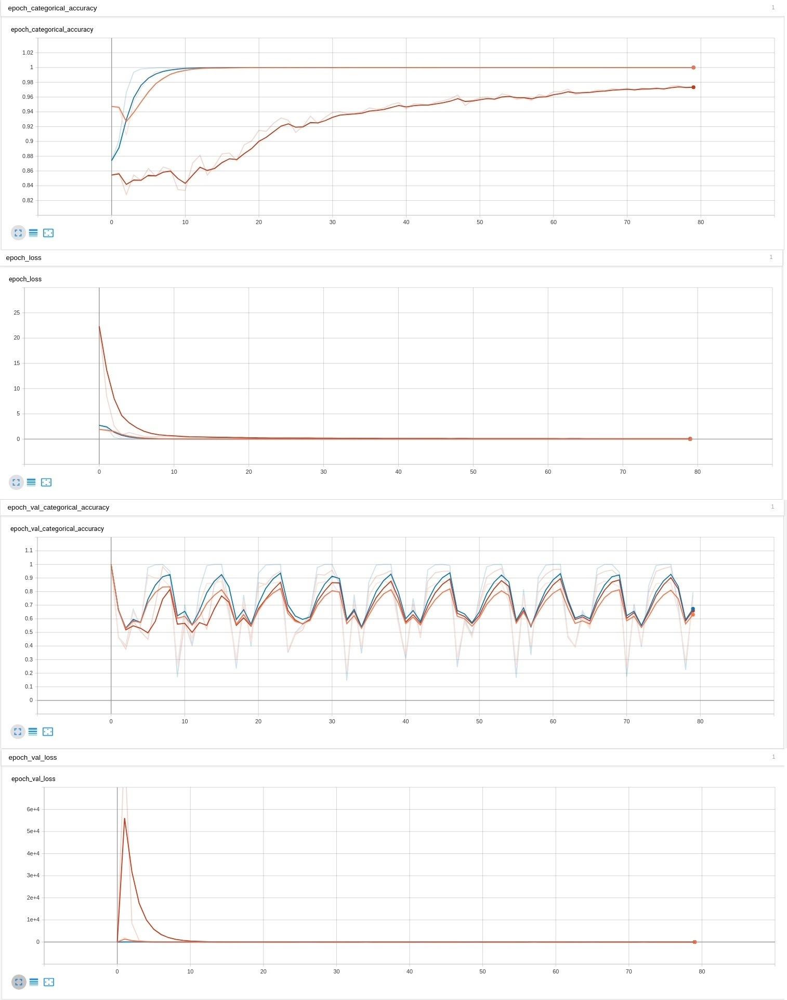
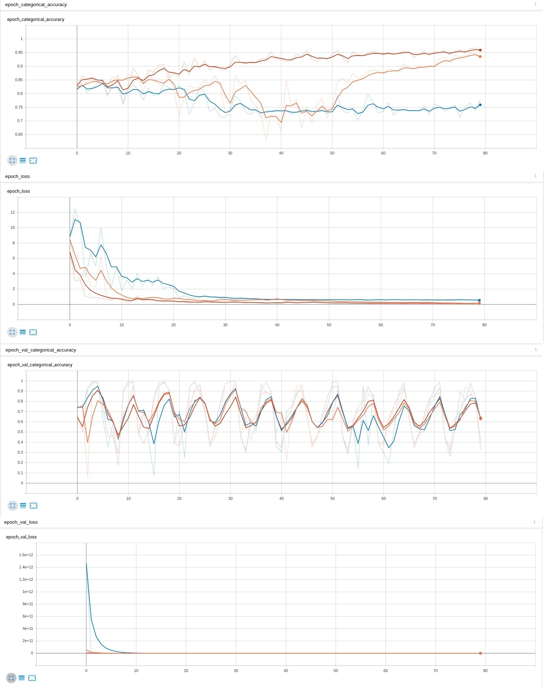
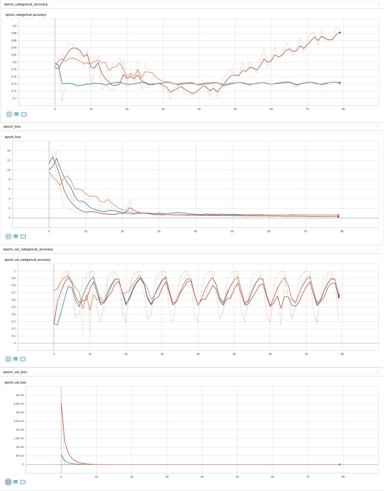
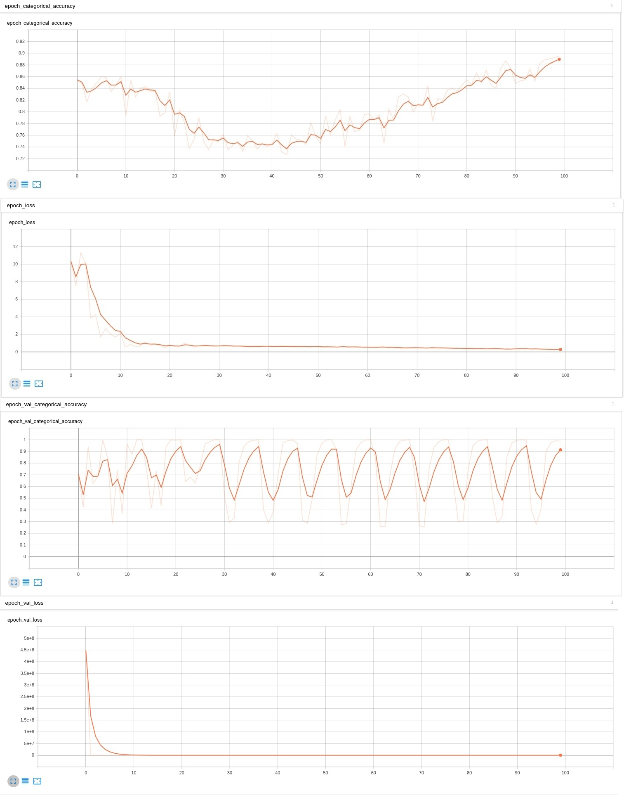

# Lab_4

# 1 блок : Горизонтальное отражение
 ### Оранжевый - lr = 0.001;
 ### Красный - lr = 0.008;
 ### Синий - lr = 0.004;
 На обучающей выборке красный график сходится уже 13-15 эпохе, в то время как оранжевый график также сходится, но уже на 32-35 эпохе, синий график был очень близок к схождению, по тенденции схождения видно, что при большем количестве эпох он также сошёлся бы. На валидационной выборке по точности все три графика демонстрируют схожее поведение, на графики точности все графики практически повторяют друг друга. На графике ошибки обучающей выборки видно, что красный сходится уже к 8-9 эпохе, оранжевый чуть позже, примерно 15-16, синий сходится позже остальных к 50 эпохе. На графике ошибки на валидационной выборке, синий график имеет самый большой пик, за ним красный, и меньший из всех имеет оранжевый график. На основе этого можно сказать, что оптимальным вариантом является красный график со значением lr = 0.008;

# 2 блок : Поворот на случайный угол
 ### Оранжевый - Поворот на 90 градусов/lr = 0.006;
 ### Красный - Поворот на 45 градусов/lr = 0.0001;
 ### Синий - Поворот на 90 градусов/lr = 0.01;
  На обучающей выборке синий график сходится уже 10 эпохе, в то время как оранжевый график также сходится, но немного позже, буквально на несколько эпох, крансый график способен обучиться, он был очень близок к схождению, по тенденции схождения видно, что при большем количестве эпох он также сошёлся бы. На графиках ошибках, как на обучающей так и на валидационной выборке, красный график значительно большие значения ошибки, в то время как синий и оранжевый графики ведут себя приблизительно похоже и имеют небольшие значения ошибки. Что касается графика точности, то тут все 3 графика практически повторяют друг друга и имеют сранивнительно небольшие скачки. В данном случае, точно можно сказать, что синий график является отпимальным со значениями угла поворотв 90 градусов и темпа обучения 0.01. Я считаю, что значение lr = 0.01 и будет масимальным

# 3 блок : Изменение яркости и контраста
### Оранжевый - lr-0.01 яркость с max_delta=0,06 и контрастность с коэффициентом 0.4-1.1
### Красный - lr-0.01 яркость с max_delta=0,09 и контрастность с коэффициентом 0.5-1,4
### Синий - lr-0.01 яркость с max_delta=0,03 и контрастность с коэффициентом 0.2-1.3
По графику обучающей выборки, видно, что синий график сильно далёк от схождения, и по тенденции видно,что даже при большем количестве эпох он вряд ли сошёлся бы. Что касается, оранжевого и красного графиков, то на данный момент, они сошлись, но при на большем количестве эпох, они сошлись бы, но оранжевый график имеет ощутимое просидание по темпу обучения на 32-50 эпохах. На графике точности, красный и оранжевый графики практически повторят друг друга, но все же в красный имеет немного меньше выбросы, синий же показывается себя хуже остальных. На графике потерь на обучающей выборке, крансый сходится быстрее остальных, синиий имеет самый большие выборосы, на валидационной выборке, красный немного лучше оранжевого, синий же показывает огромный пик. Оптимальным вариантом в моем случае является красный график(lr-0.01 яркость с max_delta=0,09 и контрастность с коэффициентом 0.5-1,4)

# 4 блок : Использование случайного участка изображения
### Оранжевый - lr - 0.01 вырез с 60х60 из 224х224
### Красный - lr - 0.01 центральное приближение на 0,2
### Синий - lr - 0.01 вырез с 120х120 из 224х224
На обучающей выборке, красный график показывает лучше остальных и при большем количестве эпох, однозначно бы сошёлся, однако все же имеет проседания по темпу. На графике точности, красный имеет самые маленькие пики, остальные два приблизительно похожи. На графике ошибки валидационной выборке, оранжевый показывает лучший результат, красный же на старте имеет достаточно высокий пик, ошибка на обучающей выборке у всех графиков, крайне похожа по тенденции, но все же красный график показывает лучший результат. В данном случае оптимальным будет красный (0.01 центральное приближение на 0,2)

# 5 блок: Совместное применение техник аугментации данных с оптимальными параметрами
### lr = 0.008. Смесь оптимальных вариантов аугментации данных различными способами.
На обучающей выборке график подошёл достаточно ближе к тому чтобы сойтись, как видно по тенденции можно с уверенностью утвержать, что при большем кольчестве эпох график бы сошёлся. График точности имеет вполне небольшие стабильные разбросы. График потерь на обучающей выборке тоже сходится, имея небольшой выброс на 5 эпохе. График потерь на валидационной выборке имеет достаточно больой пик в начале, но также и быстро сходится. 

